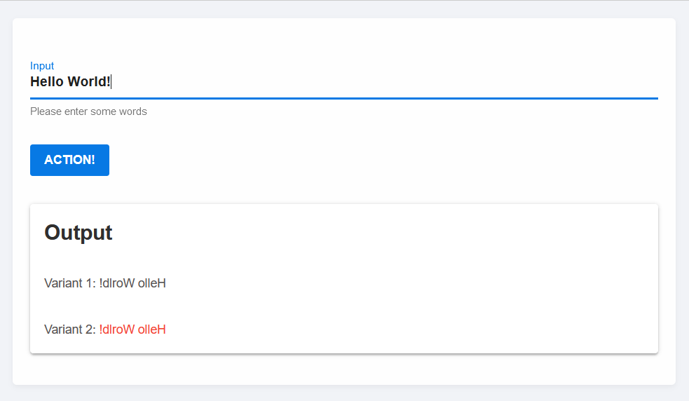

<div align="center">
  <a href="https://genieframework.com/">
    
  </a>
  <br />
  <p>
    <h3>
      <b>
        Stipple.jl
      </b>
    </h3>
  </p>
  <p>
    <ul> Reactive Data Apps in Pure Julia
    </ul>
  </p>

  [](https://www.genieframework.com/docs/) [](https://github.com/GenieFramework/Stipple.jl/blob/9530ccd4313d7a4e3da2351eb621152047bc5cbd/Project.toml#L32) [](https://www.genieframework.com/#stipple-section) [](https://github.com/GenieFramework/Stipple.jl/actions) [](https://pkgs.genieframework.com?packages=Stipple) [](https://twitter.com/AppStipple)

  
  <p>Stipple is a reactive UI library for building interactive data applications in pure Julia.
It uses <a href="https://github.com/GenieFramework/Genie.jl">Genie.jl</a> on the server side and <a href="https://vuejs.org/">Vue.js</a> on the client. Stipple uses a high performance MVVM architecture, which automatically synchronizes the state two-way
(server -> client and client -> server) sending only JSON data over the wire. The Stipple package provides the fundamental communication layer, extending <i><b>Genie's</b></i> HTML API with a reactive component.</p>
</div>


---

The Stipple ecosystem also includes:

* [StippleUI.jl](https://github.com/GenieFramework/StippleUI.jl) - the UI library for `Stipple.jl`, providing access to 30+ reactive UI elements of the [Quasar Framework](https://quasar.dev), including forms, lists, tables, as well as layout.
* [StipplePlotly.jl](https://github.com/GenieFramework/StipplePlotly.jl) - Plotting library for `Stipple.jl` based on [Plotly](https://plotly.com/javascript/)'s Graphing Library including event forwarding for interactive plots.
* [StipplePlotlyExport.jl](https://github.com/GenieFramework/StipplePlotlyExport.jl) - add-on for `StipplePlotly.jl` to allow server side generation and exporting of plots. 
* [StippleLatex.jl](https://github.com/GenieFramework/StippleLatex.jl) - support for reactive Latex content based on the [Vue-Katex](https://github.com/lucpotage/vue-katex) plugin. 

## Installation

Stipple can be added from the GitHub repo, via `Pkg`:
```julia
pkg> add Stipple
```

## Examples

### Example 1

```julia
using Stipple

@vars Name begin
  name::R{String} = "World!"
end

function ui()
  [
    h1([
      "Hello "
      span("", @text(:name))
    ])

    p([
      "What is your name? "
      input("", placeholder="Type your name", @bind(:name))
    ])
  ]
end

route("/") do
  global model
  model = Name |> init
  page(model, ui()) |> html
end

up() # or `up(open_browser = true)` to automatically open a browser window/tab when launching the app
```

This will start a web app on port 8000 and we'll be able to access it in the browser at http://localhost:8000

Once the page is loaded, we'll be able to interact with the data and see how it's synced.

We can update the name value from Julia, and see it reflected on the page, at the REPL:

```julia
julia> model.name[] = "Adrian" # updating the property in Julia will update the values on the front
```

On the webpage, we can change the name in the input field and confirm that it has been updated in Julia:

```julia
julia> model.name[] # will have the same value as what you have inputted on the web page
```

You can see a quick video demo here:
<https://www.dropbox.com/s/50t5bqd2zk4ehxo/basic_stipple_3.mp4?dl=0>

The Stipple presentation from JuliaCon 2020 is available here (8 minutes):
<https://www.dropbox.com/s/6atyctgomsqwjki/stipple_exported.mp4?dl=0>

While the above example is perfect for scipting, full web apps rely on handler functions to modify valuesin order to allow for multiple users to connect to the server and not to mix the values. This is shown in the following Example.
### Example 2

This snippet illustrates how to build a reactive UI based on StippleUI. Below you find three different ways of triggering handlers.
- Every input in the input field triggers a function that sets the inverted input string in the output field.
- Hitting the `Enter` key in the input field inverts the output string.
- Pressing of the action button inverts the output string.
StippleUI 
```julia
using Stipple, StippleUI

@vars Inverter begin
  process = false
  input = ""
  # you can explicitly define the type of the variable
  output::String = "", READONLY
end

function handlers(model)
  on(model.input) do input
      model.output[] = input |> reverse
  end

  onbutton(model.process) do
      model.output[] = model.output[] |> reverse
  end

  model
end

function ui()
  row(cell(class = "st-module", [
    textfield(class = "q-my-md", "Input", :input, hint = "Please enter some words", @on("keyup.enter", "process = true"))

    btn(class = "q-my-md", "Action!", @click(:process), color = "primary")
    
    card(class = "q-my-md", [
      card_section(h2("Output"))
      card_section("Variant 1: {{ output }}")
      card_section(["Variant 2: ", span(class = "text-red", @text(:output))])
    ])
  ]))
end

route("/") do
  model = Inverter |> init |> handlers
  page(model, ui()) |> html
end

Genie.isrunning(:webserver) || up()
```


## Choosing the transport layer: WebSockets or HTTP


By default Stipple will attempt to use WebSockets for real time data sync between backend and frontend.
However, in some cases WebSockets support might not be available on the host. In this case, Stipple can be
switched to use regular HTTP for data sync, using frontend polling with AJAX (1s polling interval by default).
Stipple can be configured to use AJAX/HTTP by passing the `transport` param to the `init()` method, ex:

```julia
model = Stipple.init(Name(), transport = Genie.WebThreads)
```

The current available options for `transport` are `Genie.WebChannels` (default, using WebSockets) and
`Genie.WebThreads` (using HTTP/AJAX).

Given that polling generates quite a number of extra requests, it can be desirable to disable automatic
logging of requests. This can be done using `Genie.config.log_requests = false`.

Support for `WebThreads` and request logging disabling has been introduced in Genie v1.14 and Stipple v0.8.

### First example changed to use `WebThreads`

```julia
using Stipple

Genie.config.log_requests = false

@vars Name begin
  name::R{String} = "World!"
end

function ui(model)
    [
      h1([
        "Hello "
        span("", @text(:name))
      ])

      p([
        "What is your name? "
        input("", placeholder="Type your name", @bind(:name))
      ])
    ]
end

route("/") do
  model = init(Name, transport = Genie.WebThreads)
  page(model, ui()) |> html
end

Genie.isrunning(:webserver) || up()
```
## ReactiveTools API

In the previous releases we silently introduced the new ReactiveTools API.
It offers a simple macro language to define variables and handlers.
```julia
using Stipple, Stipple.ReactiveTools
using StippleUI

@appname Inverter

@app begin
  @in process = false
  @out output = ""
  @in input = ""

  @onchange input begin
    output = input |> reverse
  end

  @onbutton process begin
    output = output |> reverse
  end
end

function ui()
  row(cell(class = "st-module", [
    textfield(class = "q-my-md", "Input", :input, hint = "Please enter some words", @on("keyup.enter", "process = true"))

    btn(class = "q-my-md", "Action!", @click(:process), color = "primary")
    
    card(class = "q-my-md", [
      card_section(h2("Output"))
      card_section("Variant 1: {{ output }}")
      card_section(["Variant 2: ", span(class = "text-red", @text(:output))])
    ])
  ]))
end

route("/") do
  model = @init
  page(model, ui()) |> html
end

Genie.isrunning(:webserver) || up()
```
The ReactiveTools API has a different way of defining app variables. `@in` defines variables that can be modified by the client, `@out` (or `@readonly`) defines variables that are only shown, but not modified by the client. For variables that are invisible to the client we have `@private`.
In this API the model is no longer defined explicitly, instead the macro `@init` instantiates a model including handlers. The model is attached to the current module, therefore it is only possible to define one model per module.

The new API syntax is also available for explicit models and it is possible to mix it with the classical API. For this purpose we have defined `@handlers` that only cares about the definition of handler functions.
The above example could also be defined as.


```julia
@vars Inverter begin
  process = false
  input = ""
  output = "", READONLY
end

@handlers Inverter begin
  @onchange input begin
    output = input |> reverse
  end

  @onbutton process begin
    output = output |> reverse
  end
end

route("/") do
  model = Inverter |> init |> handlers
  page(model, ui()) |> html
end
```
But also the `@app` macro is available for explicit models
```julia
@app Inverter begin
  @in process = false
  @out output = ""
  @in input = ""

  @onchange input begin
    output = input |> reverse
  end

  @onbutton process begin
    output = output |> reverse
  end
end
```

Note:
In previous versions, `@in` and `@out` defined variables in the current name space. That led to name collisions with already existing constants, functions or keywords. We therefore decided to remove that feature. The old definitions are still available as `@in!` and `@out!` instead.

## Demos
### StippleDemos
We have dedicated a Github Page to Stipple Demos with many downloadable examples at:
<https://github.com/GenieFramework/StippleDemos>
(Not all of them are updated to the latest changes of the API yet. But most of them should be functional.)
### German Credits visualisation dashboard


The full application is available at:
<https://github.com/GenieFramework/Stipple-Demo-GermanCredits>

### Iris Flowers dataset k-Means clustering dashboard


The full application is available at:
<https://github.com/GenieFramework/Stipple-Demo-IrisClustering>

### More information

While Stipple/StippleUI documentation is still evolving, you can find help and many small examples via docstrings of the functions.

```julia
help?> btn
search: btn Btn btngroup btndropdown q__btn q__btn__group q__btn__dropdown button Buttons onbutton SubString @onbutton bitstring

  Stipple has a component called btn which is a button with a few extra useful features. For instance, it comes in two shapes:
  rectangle (default) and round. It also has the material ripple effect baked in (which can be disabled).

  The button component also comes with a spinner or loading effect. You would use this for times when app execution may cause a      
  delay and you want to give the user some feedback about that delay. When used, the button will display a spinning animation as     
  soon as the user clicks the button.

  When not disabled or spinning, btn emits a @click event, as soon as it is clicked or tapped.

  Examples
  ≡≡≡≡≡≡≡≡≡≡

  julia> btn("Move Left", color = "primary", icon = "mail", @click("press_btn = true"))

  julia> btn("Go to Hello World", color = "red", type = "a", href = "hello", icon = "map", iconright = "send")

  julia> btn("Connect to server!", color="green", textcolor="black", @click("btnConnect=!btnConnect"), [
            tooltip(contentclass="bg-indigo", contentstyle="font-size: 16px",
            style="offset: 10px 10px",  "Ports bounded to sockets!")]
         )

  ─────────────────────────────────────────────────────────────────────────────────────────────────────────────────────────────────  

  Arguments
  ≡≡≡≡≡≡≡≡≡≡≡

  ─────────────────────────────────────────────────────────────────────────────────────────────────────────────────────────────────  

    1. Behavior
       • loading::Bool - Put button into loading state (displays a spinner – can be overridden by using a 'loading'
       slot)
       • percentage::Union{Int, Float64} - Percentage (0.0 < x < 100.0); To be used along 'loading' prop; Display a
       progress bar on the background ex. 23
       • darkpercentage::Bool - Progress bar on the background should have dark color; To be used along with
       'percentage' and 'loading' props

    2. Content
       • label::Union{String, Int} - The text that will be shown on the button ex. Button Label
       • icon::String - Icon name following Quasar convention; Make sure you have the icon library installed unless
       you are using 'img:' prefix; If 'none' (String) is used as value then no icon is rendered (but screen real
       estate will still be used for it) ex. map ion-add img:https://cdn.quasar.dev/logo/svg/quasar-logo.svg
       img:path/to/some_image.png
       • iconright::String - Icon name following Quasar convention; Make sure you have the icon library installed
       unless you are using 'img:' prefix; If 'none' (String) is used as value then no icon is rendered (but screen
       real estate will still be used for it) ex. map ion-add img:https://cdn.quasar.dev/logo/svg/quasar-logo.svg
       img:path/to/some_image.png
       • nocaps::Bool - Avoid turning label text into caps (which happens by default)
       • nowrap::Bool - Avoid label text wrapping
       • align::String - Label or content alignment default. center accepted values. left right center around between
       evenly
       • stack::Bool - Stack icon and label vertically instead of on same line (like it is by default)
       • stretch::Bool - When used on flexbox parent, button will stretch to parent's height

    3. General
       • type::String - 1) Define the button native type attribute (submit, reset, button) or 2) render component with
       <a> tag so you can access events even if disable or 3) Use 'href' prop and specify 'type' as a media tag
       default. button ex. a submit reset button image/png href="https://some-site.net" target="_blank"
       • tabindex::Union{Int, String} - Tabindex HTML attribute value

    4. Navigation
       • href::String - Native <a> link href attribute; Has priority over the 'to' and 'replace' props ex.
       https://quasar.dev href="https://quasar.dev" target="_blank"
       • target::String - Native <a> link target attribute; Use it only with 'to' or 'href' props ex. _blank _self
       _parent _top

    5. State
       • loading::Bool - Put button into loading state (displays a spinner – can be overridden by using a 'loading'
       slot)
       • padding::String - Apply custom padding (vertical [horizontal]); Size in CSS units, including unit name or
       standard size name (none|xs|sm|md|lg|xl); Also removes the min width and height when set
       • color::String - Color name for component from the Color Palette (https://quasar.dev/style/color-palette) eg.
       primary teal-10
       • textcolor::String - Overrides text color (if needed); Color name from the Color Palette
       (https://quasar.dev/style/color-palette) eg. primary teal-10
       • dense::Bool - Dense mode; occupies less space
       • round::Bool - Makes a circle shaped button
```
## Acknowledgements

Stipple builds upon the excellent [Vue.js Framework](https://quasar.dev/vue-components)
