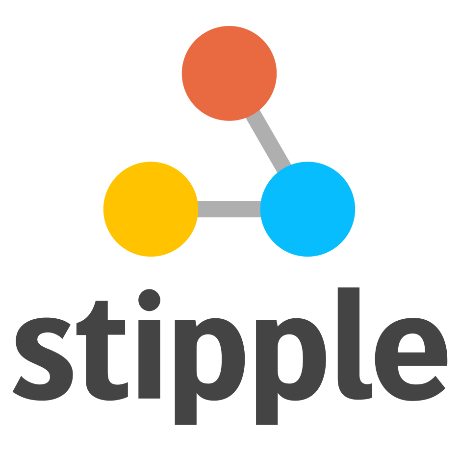

<div align="center">
  <a href="https://genieframework.com/">
    
  </a>
  <br />
  <p>
    <h3>
      <b>
        Stipple.jl
      </b>
    </h3>
  </p>
  <p>
    <ul> Reactive Data Apps in Pure Julia
    </ul>
  </p>

  [](https://www.genieframework.com/docs/) [](https://github.com/GenieFramework/Stipple.jl/blob/9530ccd4313d7a4e3da2351eb621152047bc5cbd/Project.toml#L32) [](https://www.genieframework.com/#stipple-section) [](https://github.com/GenieFramework/Stipple.jl/actions) [](https://pkgs.genieframework.com?packages=Stipple) [](https://twitter.com/AppStipple)

  <p>
    <a href="https://www.genieframework.com/">
      
    </a>
  </p>
</div>

<p style="font-family:verdana;font-size:60%;margin-bottom:4%" align="center">
<u>Julia data dashboard powered by Stipple and Genie. <a href="https://learn.genieframework.com/app-gallery">App gallery</a></u>
</p>
  
Part of [Genie Framework](https://genieframework.com), Stipple is a reactive UI library for building interactive data applications in pure Julia.
It uses <a href="https://github.com/GenieFramework/Genie.jl">Genie.jl</a> on the server side and <a href="https://vuejs.org/">Vue.js</a> on the client. Stipple uses a high performance architecture that automatically synchronizes the state two-way (server -> client and client -> server), sending only JSON data over the wire.
</div>

Besides the low-code API provided by Stipple, you can also use [Genie Builder](https://learn.genieframework.com/docs/genie-builder/quick-start) to build your reactive UIs. Genie Builder is a plugin for VSCode to help you create interactive Genie apps much faster using its visual drag-and-drop editor.


To learn more about Stipple and Genie Framework, visit the [documentation](https://learn.genieframework.com/docs/guides), and the [app gallery](https://learn.genieframework.com/app-gallery).


If you need help with anything, you can find us on [Discord](https://discord.com/invite/9zyZbD6J7H).

---

The Stipple ecosystem also includes:

* [StippleUI.jl](https://github.com/GenieFramework/StippleUI.jl) - the UI library for `Stipple.jl`, providing access to 30+ reactive UI elements of the [Quasar Framework](https://quasar.dev), including forms, lists, tables, as well as layout.
* [StipplePlotly.jl](https://github.com/GenieFramework/StipplePlotly.jl) - Plotting library for `Stipple.jl` based on [Plotly](https://plotly.com/javascript/)'s Graphing Library including event forwarding for interactive plots.
* [StipplePlotlyExport.jl](https://github.com/GenieFramework/StipplePlotlyExport.jl) - add-on for `StipplePlotly.jl` to allow server side generation and exporting of plots. 
* [StippleLatex.jl](https://github.com/GenieFramework/StippleLatex.jl) - support for reactive Latex content based on the [Vue-Katex](https://github.com/lucpotage/vue-katex) plugin. 
## News: Vue 3 / Quasar 2

From version 0.30 on Stipple has upgraded the front-end libraries to Vue3 / Quasar 2, as Vue-2 has reached its end-of-life.
We recommend to use at least v0.30.3, as we have fixed some relevant bugs.
(Some of these bugs were also present in previous Vue2 versions.
we therefore recommend to use at least v0.29.1 for legacy Vue2 support.)

We have put lots of effort in making migration as easy as possible. Nevertheless, there are some places where advanced apps might need a little tweeking.

## Main Changes for version >= v0.30

First of all, basic applications continue to function properly without any changes.

However, if you have developed applications with external plugins or components you might need to do some adaptations.
We have introduced a vue2compat layer to make the migration as easy as possible.

### Components
- Components can no longer be registered in Vue, but rather in the app instance. If you are using legacy components, e.g. by including Vue libraries, you can verify whether they have been recognized by entering `vueLegacy` in the browser console once the page has been loaded (right-click -> 'Inspect'). Under the field "components" you will find the components to be registered. Registering is then done by adding `Stipple.register_global_component("<component name>", legacy = true)` to your app.
- Vue-2 components often use `this.$set(this.field, key, value)` to set object fields, which is incompatible with Vue-3 syntax. Use a normal assignment instead, e.g. `field[key] = value`

### Plugins
If libraries install plugins, they need to be added to the app via `Stipple.add_plugin(MyApp, "<plugin name>")`.
If you are using explicit models replace 'MyApp' by the model type, otherwise use the module's name.

### Component Attributes
Vue-2 syntax for synchronizing additional fields other than the v-model has changed from `<fieldname>.sync` to `v-model:<fieldname>`, e.g. from `:pagination.sync = "myvar` to `v-model:pagination = "myvar"`. In StippleUI we had offered "paginationsync = :myvar" which will be automatically translated to the new syntax. If want to explicitly enter the original form, you can do so by using the var"" syntax, " , e.g. `table(:mytable, var"v-model:pagination" = "test")`

### Templates
In Vue-3 `v-if` and `v-for` precedence have change. So if you use both attributes in one component make sure to split your component in a container with a `v-for` attribute and a component, e.g. `div` or `span` with a `v-if` attribute.
In StippleUI syntax `v-if` corresponds to `@if("...")`and `v-for`  corresponds to `@for("...")`

### More Migration Support 
... can be found at the Quasar site: https://quasar.dev/start/upgrade-guide/
and at the Vue site: https://v3-migration.vuejs.org/

## Installation

Stipple can be added from the GitHub repo, via `Pkg`:
```julia
pkg> add Stipple
```

## Example

This snippet below illustrates the structure of a reactive UI built with Stipple. See its [documentation page](https://learn.genieframework.com/docs/reference/reactive-ui/introduction) for a detailed explanation.

```julia
module App
#setup of the Genie Framework environment
using GenieFramework
@genietools

# reactive code
@app begin
    # reactive variables synchronised between server and browser
    @in N = 0
    @out msg = ""
    #reactive handler, executes code when N changes
    @onchange N begin
        msg = "N = $N"
    end
end

# UI components
function ui()
    [
        cell([
                p("Enter a number")
                # variables are bound to a component using their symbol name
                textfield("N", :N )
            ])
        cell([
                bignumber("The value of N is", :N)
            ])
    ]
end

# definition of root route
@page("/", ui)
end
```

 </img>

## More information

While Stipple/StippleUI documentation is still evolving, you can find help and many small examples via docstrings of the functions.

```julia
help?> btn
search: btn Btn btngroup btndropdown q__btn q__btn__group q__btn__dropdown button Buttons onbutton SubString @onbutton bitstring

  Stipple has a component called btn which is a button with a few extra useful features. For instance, it comes in two shapes:
  rectangle (default) and round. It also has the material ripple effect baked in (which can be disabled).

  The button component also comes with a spinner or loading effect. You would use this for times when app execution may cause a      
  delay and you want to give the user some feedback about that delay. When used, the button will display a spinning animation as     
  soon as the user clicks the button.

  When not disabled or spinning, btn emits a @click event, as soon as it is clicked or tapped.

  Examples
  ≡≡≡≡≡≡≡≡≡≡

  julia> btn("Move Left", color = "primary", icon = "mail", @click("press_btn = true"))

  julia> btn("Go to Hello World", color = "red", type = "a", href = "hello", icon = "map", iconright = "send")

  julia> btn("Connect to server!", color="green", textcolor="black", @click("btnConnect=!btnConnect"), [
            tooltip(contentclass="bg-indigo", contentstyle="font-size: 16px",
            style="offset: 10px 10px",  "Ports bounded to sockets!")]
         )

  ─────────────────────────────────────────────────────────────────────────────────────────────────────────────────────────────────  

  Arguments
  ≡≡≡≡≡≡≡≡≡≡≡

  ─────────────────────────────────────────────────────────────────────────────────────────────────────────────────────────────────  

    1. Behavior
       • loading::Bool - Put button into loading state (displays a spinner – can be overridden by using a 'loading'
       slot)
       • percentage::Union{Int, Float64} - Percentage (0.0 < x < 100.0); To be used along 'loading' prop; Display a
       progress bar on the background ex. 23
       • darkpercentage::Bool - Progress bar on the background should have dark color; To be used along with
       'percentage' and 'loading' props

    2. Content
       • label::Union{String, Int} - The text that will be shown on the button ex. Button Label
       • icon::String - Icon name following Quasar convention; Make sure you have the icon library installed unless
       you are using 'img:' prefix; If 'none' (String) is used as value then no icon is rendered (but screen real
       estate will still be used for it) ex. map ion-add img:https://cdn.quasar.dev/logo/svg/quasar-logo.svg
       img:path/to/some_image.png
       • iconright::String - Icon name following Quasar convention; Make sure you have the icon library installed
       unless you are using 'img:' prefix; If 'none' (String) is used as value then no icon is rendered (but screen
       real estate will still be used for it) ex. map ion-add img:https://cdn.quasar.dev/logo/svg/quasar-logo.svg
       img:path/to/some_image.png
       • nocaps::Bool - Avoid turning label text into caps (which happens by default)
       • nowrap::Bool - Avoid label text wrapping
       • align::String - Label or content alignment default. center accepted values. left right center around between
       evenly
       • stack::Bool - Stack icon and label vertically instead of on same line (like it is by default)
       • stretch::Bool - When used on flexbox parent, button will stretch to parent's height

    3. General
       • type::String - 1) Define the button native type attribute (submit, reset, button) or 2) render component with
       <a> tag so you can access events even if disable or 3) Use 'href' prop and specify 'type' as a media tag
       default. button ex. a submit reset button image/png href="https://some-site.net" target="_blank"
       • tabindex::Union{Int, String} - Tabindex HTML attribute value

    4. Navigation
       • href::String - Native <a> link href attribute; Has priority over the 'to' and 'replace' props ex.
       https://quasar.dev href="https://quasar.dev" target="_blank"
       • target::String - Native <a> link target attribute; Use it only with 'to' or 'href' props ex. _blank _self
       _parent _top

    5. State
       • loading::Bool - Put button into loading state (displays a spinner – can be overridden by using a 'loading'
       slot)
       • padding::String - Apply custom padding (vertical [horizontal]); Size in CSS units, including unit name or
       standard size name (none|xs|sm|md|lg|xl); Also removes the min width and height when set
       • color::String - Color name for component from the Color Palette (https://quasar.dev/style/color-palette) eg.
       primary teal-10
       • textcolor::String - Overrides text color (if needed); Color name from the Color Palette
       (https://quasar.dev/style/color-palette) eg. primary teal-10
       • dense::Bool - Dense mode; occupies less space
       • round::Bool - Makes a circle shaped button
```
## Acknowledgements

Stipple builds upon the excellent [Vue.js Framework](https://quasar.dev/vue-components)
